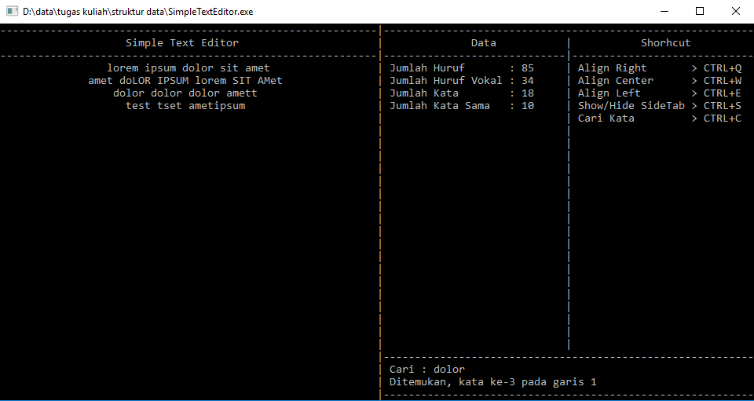
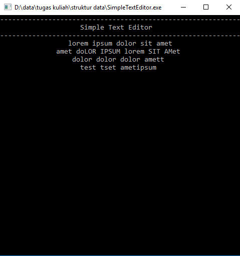

# SimpleTextEditor - C

SimpleTextEditor adalah aplikasi Text Editor Sederhana yang saya buat menggunakan bahasa C untuk memenuhi tugas kuliah Struktur data. Dtruktur data yang saya gunakan pada aplikasi ini adalah LinkedList dan

## Fitur

SimpleTextEditor ini memiliki beberapa fitur

- Hitung Jumlah Huruf
- Hitung Jumlah Huruf Vokal
- Hitung Jumlah Kata
- Hitung Kata Sama
- Cari Kata
- Align Right, Center, Left
- Show/Hide SideTab

## Tampilan Aplikasi

- Show SideTab 

- Hide SideTab

